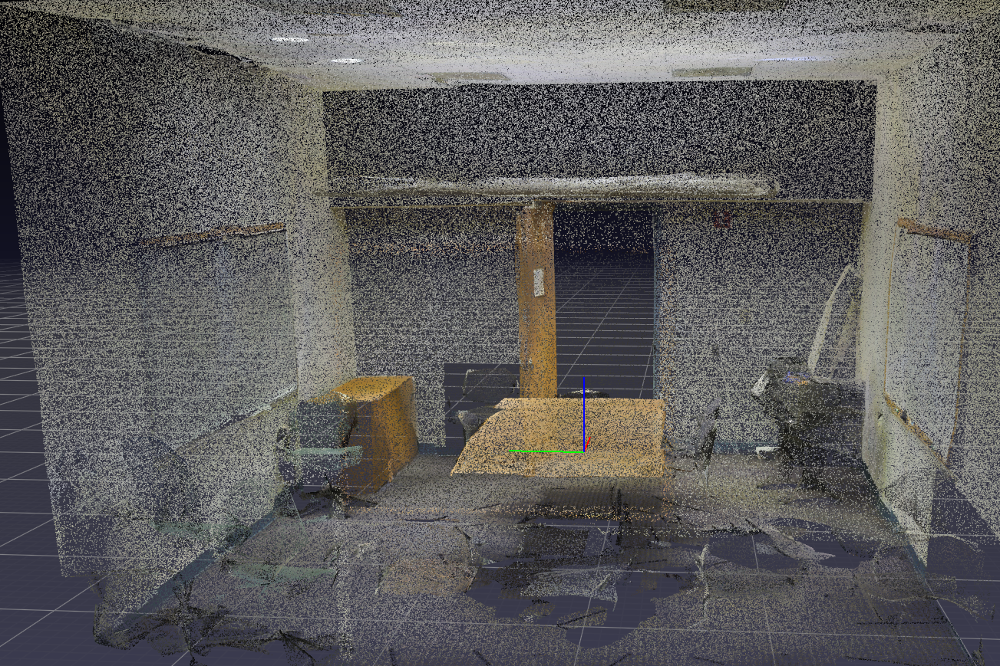
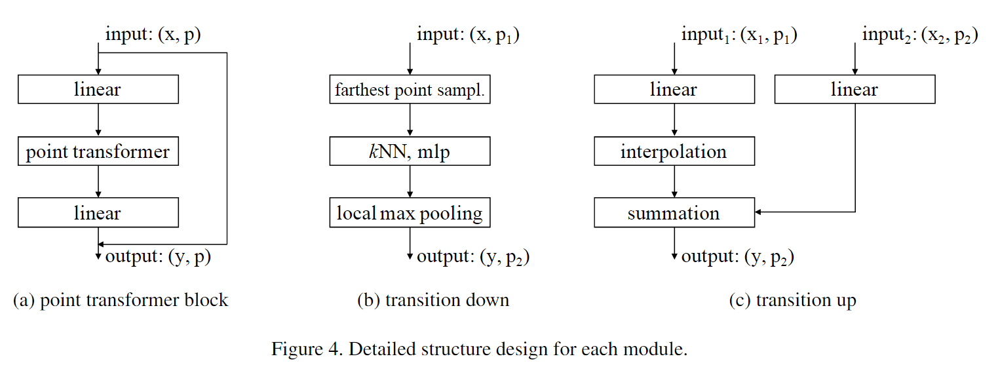
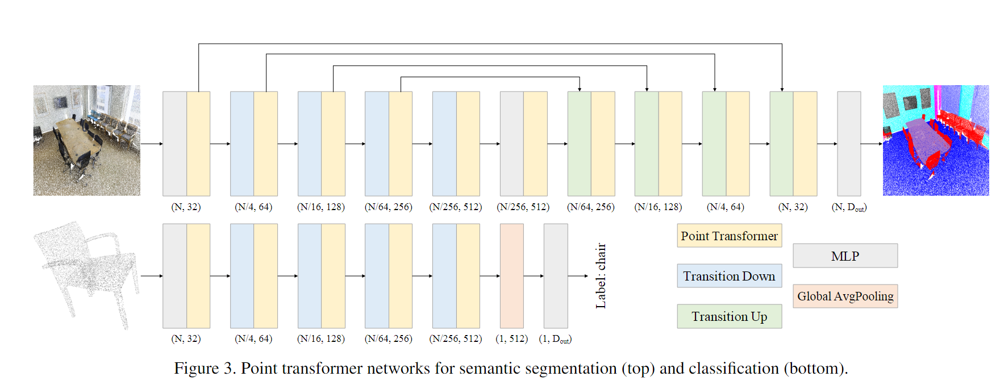
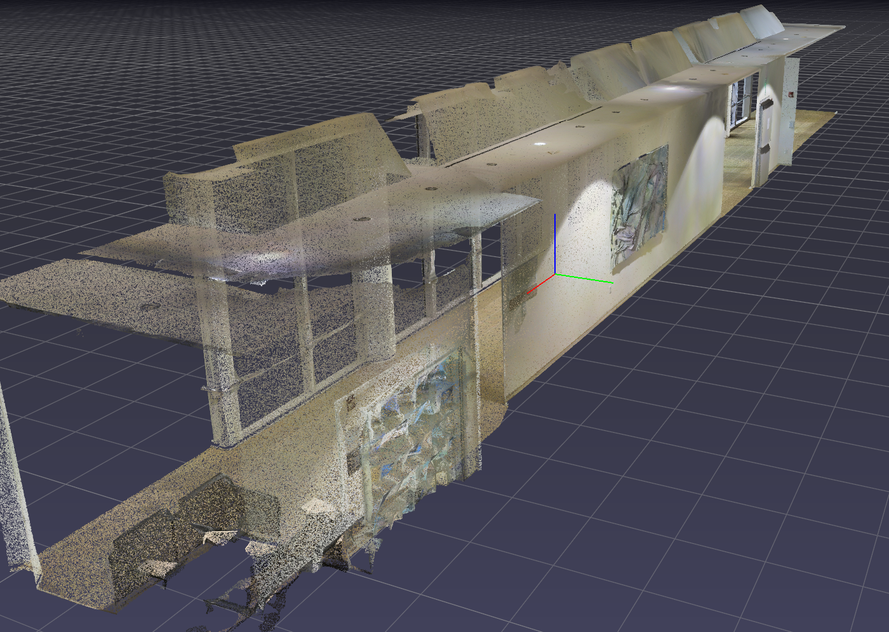
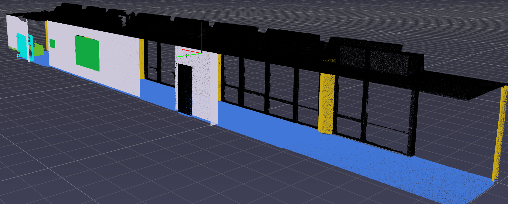
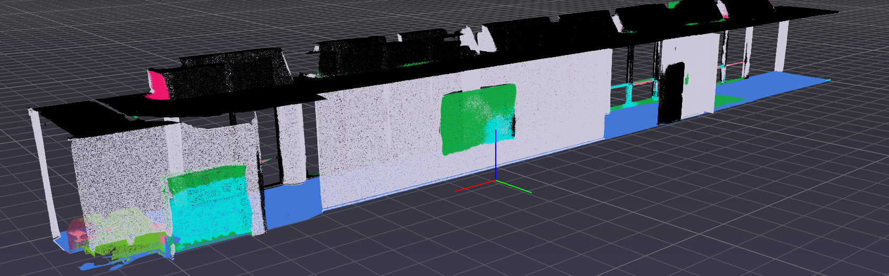
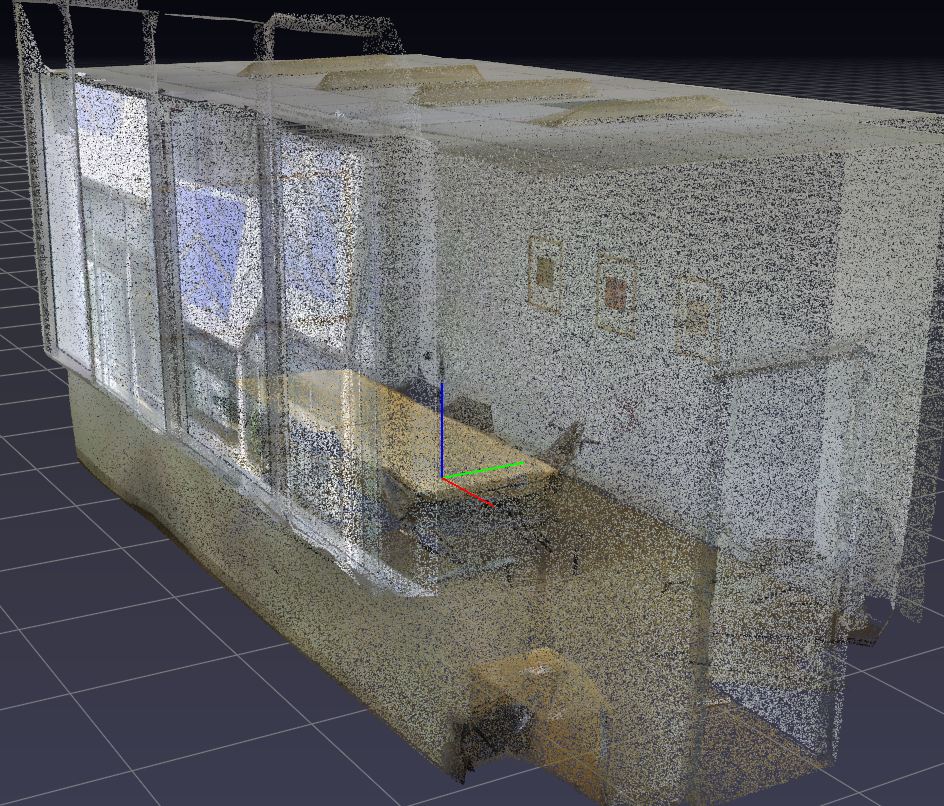
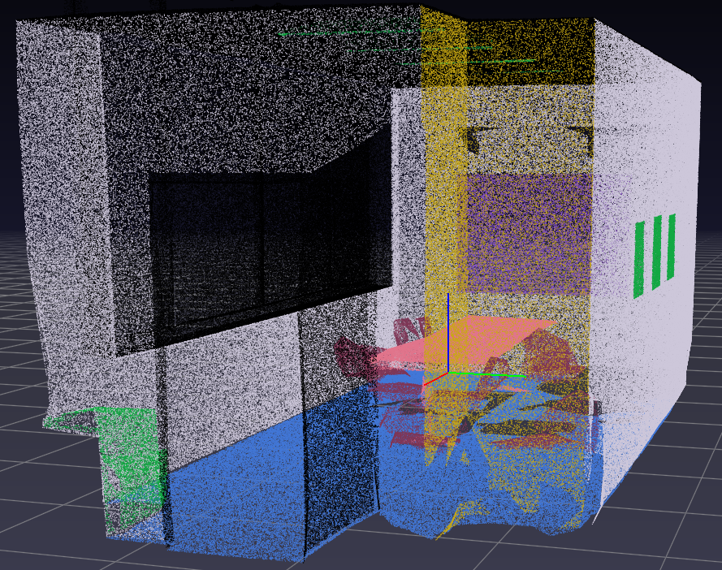
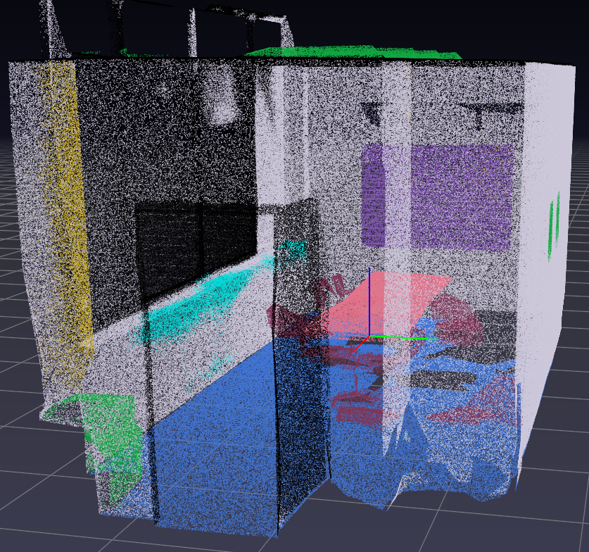
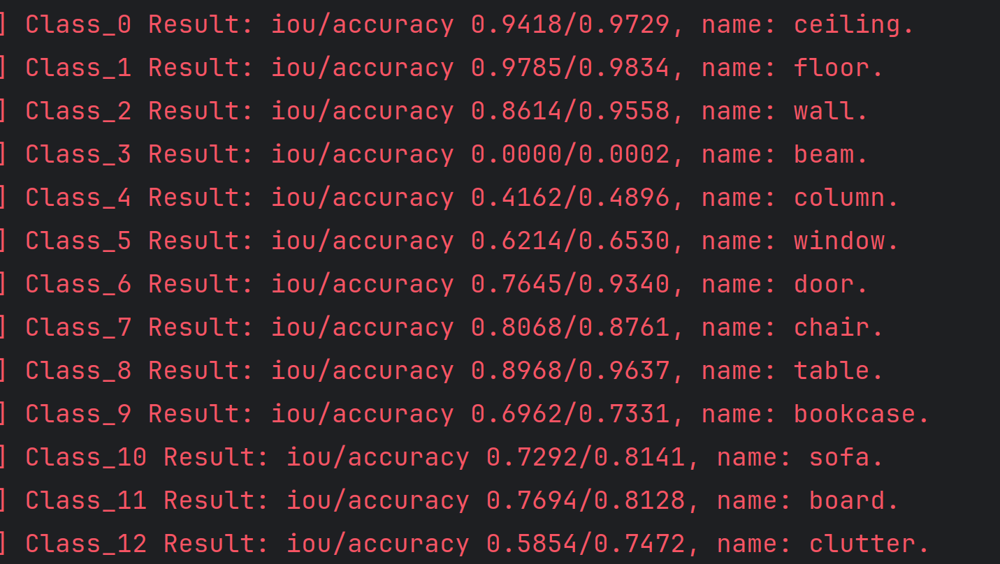

# 一.Point Transformer
对 **Point Transformer** 代码和实验的学习。 

点云数据集**S3DIS**，包含室内场景的三维点云以及语义标签，每个点包含位置和颜色信息。



## 网络结构
在`/Point Transformer/segnet.txt`中包含网络的整体结构，如下图：

通过5个**encoder**和5个**decoder**完成点云的语义分割任务。
|模型输入 | 维度 | 
|-------| ------| 
|coord| (n,3) | 
|feature | (n,3) |
|offset | (b) |

|模块 | 子模块 | 含义 | 
|-------| ------| ----| 
|PointTransformerSeg| encoder[:5],decoder[:5] | 整个模型 |
|PointTransformerBlock|PointTransformerLayer|提取特征|
|PointTransformerLayer|queryandgroup|transformer|
|Encoder | 1个TransitionDown，动态个PointTransformerBlock | 编码器，提取特征 |
|TransitionDown|furthestsampling,queryandgroup|下采样，特征升维|
|furthestsampling||最远点采样|
|queryandgroup|knn|根据k近邻分组|
|TransitionUp|interpolation|上采样，特征拼接|
|interpolation|knn|根据k近邻插值新特征|

运行逻辑：
pxo分别代表位置、特征、偏移量

- PointTransformerSeg
  - pxo=Enc5(Enc4(Enc3(Enc2(Enc1(pxo)))))
  
    调用：

    - Enc1：
      - TransitionDown：输入pxo，输出pxo，相当于MLP
        - stride==1:```Relu(bn(linear(x)))```,x维度从6(coord+feature拼接)变为32
      - TransformerBlock：输入pxo，输出pxo

          ```
          identity=x //用于残差
          x=relu(bn1(linear1(x))) //维度不变
          x=relu(bn2(transformer2(pxo)))
          ```
        
        调用：
          - PointTransformerLayer：输入pxo，输出x
            ```
            x_q,x_k,x_v=linear_q(x),linear_k(x),linear_v(x)//得到QKV
            x_k=queryandgroup(x_k)
            x_v=queryandgroup(x_v)
            ```
            
            调用：
              - queryandgroup：输入(nsample,p,xyz,feature,offset),feature分别为x_k、x_v，输出为x
                - 调用```knn(nsample,xyz,offset)```，返回idx，维度为(n，nsample)，表示每个点周围nsample个点的下标
                - xyz维度是(n,3)，重新组织：```group_xyz=xyz[idx.view(-1).long(),:].view(n,nsample,3) 
                group_feature=feature[idx.view(-1).long(),:].view(n,nsample,c)```其中c为32
                - 对于x_k返回group_xyz和group_feature的拼接，对于x_v返回group_feature，得到x_k维度为(n,8,35),x_v维度为(n,8,32)
              
              ```
              p_r，x_k=x_k[:,:,0:3],x_k[:,:,3:]
              p_r=linear_p(p_r) //位置编码
              w=x_k-x_q+p_r //采用差关系，加上位置编码
              w=linear_w(w)
              x=(x_v+p_r)*w
              ```
              返回x，维度为(n,32)
    - Enc2:输入为pxo，维度(n=110327,3),(n,32),(4)
      - TransitionDown:输入pxo，输出pxo
        - 采用最远点采样，返回采样点下标，个数为n/4=27580，采用querygroup，在原数组xyz中，找到新数组new_xyz的k=16近邻，返回group_xyz和group_feat的拼接，即返回的x维度为(n/4=27580，16，25)
        - ```Relu(bn(linear(x)))``` ```x=pool(x).squeeze(-1)```，得到x维度(n/4,64)
      - 2个PointTransformerBlock:输入pxo，(n/4,3),(n/4,64),(4)，输出pxo
        ```
        identity=x
        Relu(bn1(linear1(x))) 不改变维度
        x=relu(bn2(transformer2(pxo)))
        ```
        同样调用PointTransformerLayer：
          - querygroup：得到x_k维度(n/4，16，67)，x_v维度(n/4，16，64)
          - 返回x，维度为(n/4,64)
      
        再经过第二个PointTransformerBlock，维度不变,
返回pxo，x维度(n/4，64)

    - Enc3:输入pxo，维度(n/4,3)(n/4,64)(4)；输出pxo，维度(n/16,3)(n/16,128)(4)
    - Enc4:输出pxo，维度(n/64=1721，3)(n/64,256)(4)
    - Enc5:输出pxo，维度(n/256=428，3)(n/256，512)，(4)
  - x=(dec1(pxo1,dec2(pxo2,dec3(pxo3,dec4(pxo4,dec5(pxo5))))))
    - Dec5：
      - TransitionUp：输入pxo，x维度(n/256=428,512),输出x
        - MLP，维度不变
      - TransformerBlock：输入pxo，维度(428，3)，(428，512)，(4)
    - Dec4:
      - TransitionUp:
        - 输入pxo1(enc4的计算结果，维度(n/64=1721,3),(n/64,256),(4))；pxo2(enc5和dec5计算结果，维度(428，3),(428,512),(4))
        - ```x=linear1(x1)+interpolation(p2,p1)```
        
        调用:
          - interpolation：
            - 输入p1维度（428，3）、p2（1721，3），feat=linear(x2)（428，256），返回新的特征
            - p1、p2作为新旧点集计算knn，得到p1的k=3近邻，计算距离的倒数，归一化，作为权重，new_feat+=feat[idx]*weight,即k=3近邻的点的权重乘以该点的特征相加
            返回new_feat,维度为（1721，256）
      - 多个PointTransformerBlock:输入pxo，（1721，3），（n/64=1721，256），（4）
    - dec3:
      - TransitionUp:输入pxo1（enc3计算结果）（6894，3）（6894，128）（4）；pxo2（enc4和dec4计算结果）（1721，3）（1721，256）（4）返回x维度（n/16=6894，128）
      - PoinTransformer类似
    - dec2:
      - TransitionUp:输入pxo1（enc2计算结果）（n/4=27580，3）（n/4=27580，64）（4）；pxo2（enc3和dec3计算结果）（6894，3）（6894，128）（4）
              返回x维度（n/4，64）
    - dec1:
      - TransitionUp:输入pxo1（enc1计算结果）（n=110327，3）（n=110327，32）（4）；pxo2（enc2和dec2计算结果）（n/4=27580，3）（n/4=27580，64）（4）
      返回x维度（n=110327，32）
    - ```x=linear（bn(relu(linear(x)))）```输出维度（n,13）

## 网络补充
上图网络结构中，箭头都是顺序从左往右，但decoder每个模块是有相对应的encoder模块箭头直达的，也就是将点数从$\frac{N}{64}$变为$\frac{N}{16}$的实现，而连续的指向$\frac{N}{16}$的箭头，是为了传入$\frac{N}{64}$个点的特征信息。插值过程是选择$\frac{N}{16}$个点的k近邻，且邻点在$\frac{N}{64}$中，加权求和，加到新的特征中。

作者提出自己的transformer的公式$\mathbf{y}_i=\sum_{\mathbf{x}_j \in \mathcal{X}(i)} \rho\left(\gamma\left(\varphi\left(\mathbf{x}_i\right)-\psi\left(\mathbf{x}_j\right)+\delta\right)\right) \odot\left(\alpha\left(\mathbf{x}_j\right)+\delta\right)$，其中$\mathcal{X}(i) \subseteq \mathcal{X}$是$\mathbf{x}_i$邻域knn点集。$\delta$是位置编码

## 实验结果
- 长廊
    
  原始数据
  
  真实标签
  
  实验效果
  
- 会议室

  原始数据
  
  真实标签
  
  实验效果
  

**实验数据**

将epoch和batch_size调小后的结果


